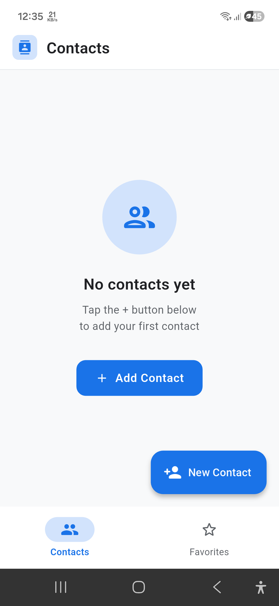
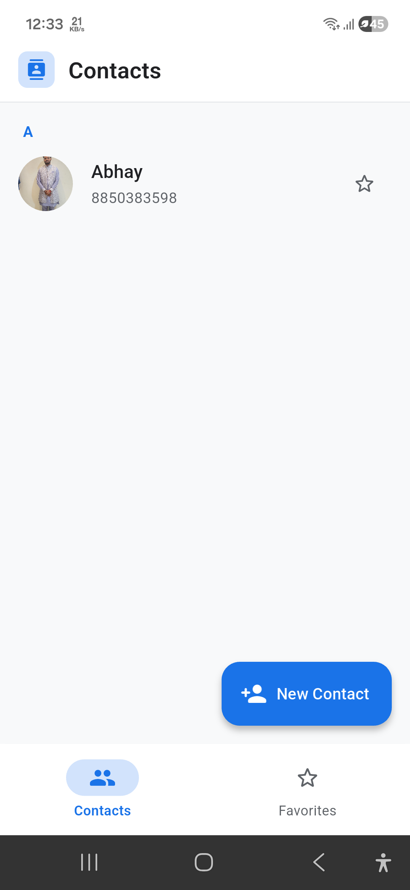
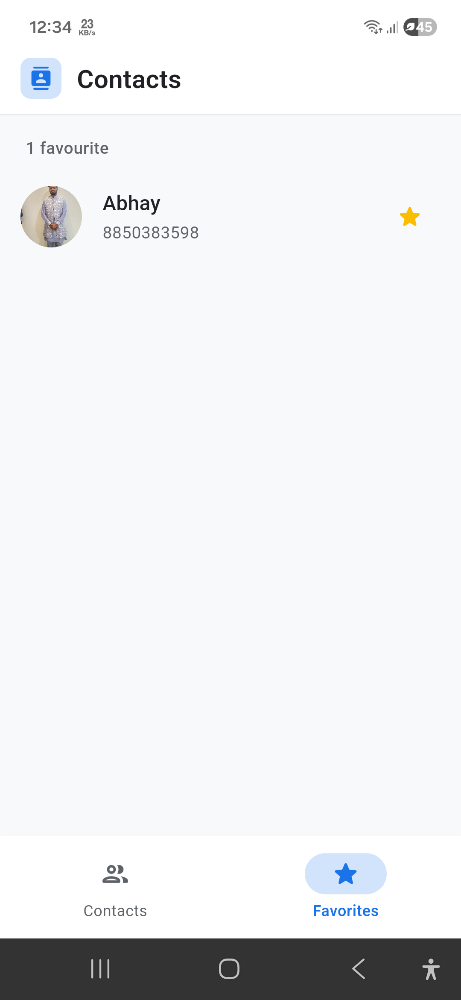
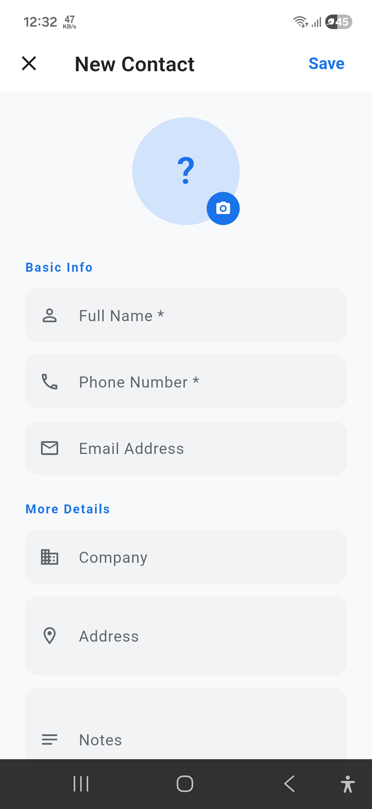
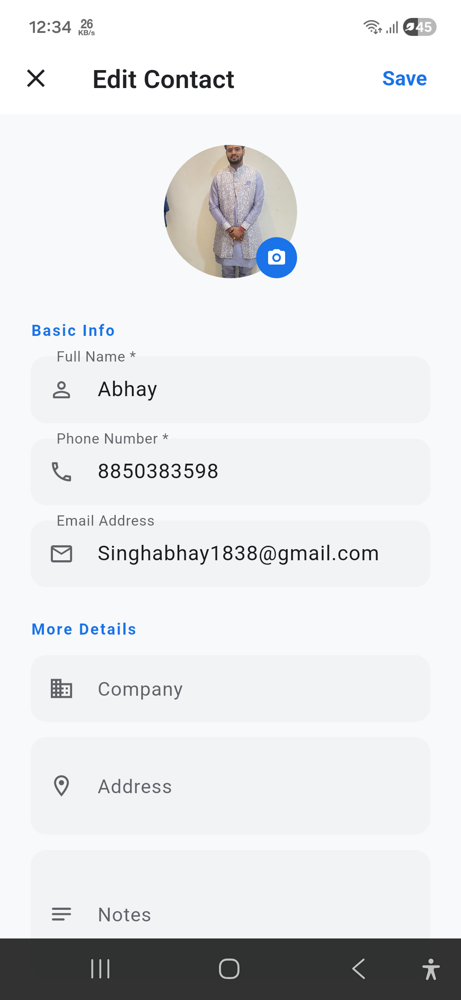
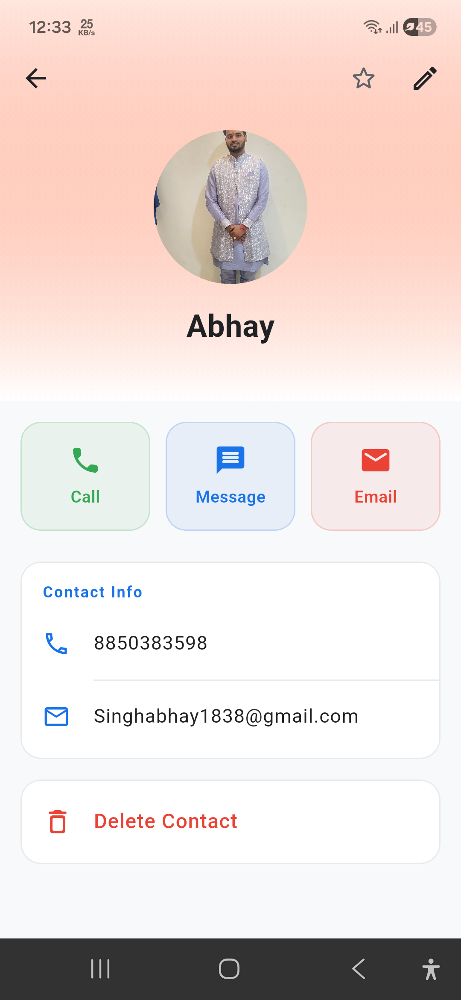
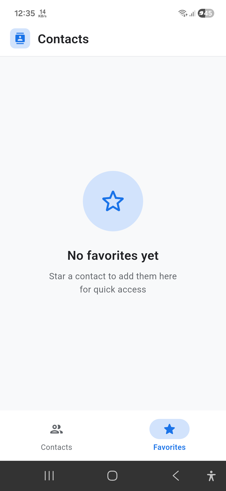
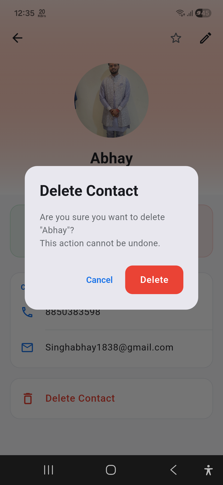

# 📱 Contacts App — Flutter

A fully-featured Google Contacts-like application built with Flutter, using **Provider** for state management and **MVC architecture** for clean separation of concerns.

---

## 📸 App Screenshots

### Home Screen — Contacts Tab (Empty & With Contacts)

<p float="left">
  
  &nbsp;&nbsp;
  
  &nbsp;&nbsp;
  
</p>

> Left: Empty state with "No contacts yet" prompt and FAB. Middle: Contacts list with alphabetical section header "A" and a saved contact showing photo and phone number. Right: Favorites tab showing a starred contact.

---

### Add Contact & Edit Contact

<p float="left">
  
  &nbsp;&nbsp;&nbsp;
  
</p>

> Left: New Contact form with avatar placeholder, Basic Info fields (Name, Phone, Email) and More Details (Company, Address, Notes). Right: Edit Contact with the same form pre-filled with existing contact data and real photo shown in the avatar.

---

### Contact Detail & Favorites Empty State

<p float="left">
  
  &nbsp;&nbsp;&nbsp;
  
</p>

> Left: Contact profile with hero avatar, gradient header, three action buttons (Call, Message, Email), Contact Info card showing phone and email, and Delete Contact option. Right: Favorites tab empty state with "No favorites yet" message.

---

### Delete Confirmation Dialog

<p align="center">
  
</p>

> Confirmation dialog with contact name, warning message "This action cannot be undone", and Cancel / Delete buttons — preventing accidental deletions.

---

## ✨ Features

| Feature | Status | Description |
|---|---|---|
| **Add Contact** | ✅ | Full form with name, phone, email, address, company, notes & photo |
| **Edit Contact** | ✅ | Pre-filled form for updating any contact field |
| **Delete Contact** | ✅ | Confirmation dialog before permanent deletion |
| **Contact Detail** | ✅ | Profile page with gradient header and action buttons |
| **Call Contact** | ✅ | One-tap calling via device dialer (`tel:` scheme) |
| **Send SMS** | ✅ | One-tap messaging (`sms:` scheme) |
| **Favorites** | ✅ | Star/unstar contacts; dedicated Favorites tab |
| **Photo Picker** | ✅ | Camera or gallery photo for each contact |
| **Offline Storage** | ✅ | SQLite for fully offline data persistence |

---

## ✨ Upcoming Features

| Feature        | Status | Description                                       |
|----------------|--------|---------------------------------------------------|
| **Send Email** | ✅      | One-tap email composition (`mailto:` scheme)      |
| **Search**     | ✅      | Real-time SQLite search across name, phone, email |

---

## 🏗️ Architecture — MVC + Provider

```
lib/
├── main.dart                          # App entry point, routing, animations
├── models/
│   └── contact_model.dart             # M — Data model, SQLite mapping
├── controllers/
│   └── contact_controller.dart        # C — Business logic, validation
├── providers/
│   └── contact_provider.dart          # State management (ChangeNotifier)
├── services/
│   └── database_service.dart          # SQLite CRUD layer (singleton)
├── views/
│   ├── screens/
│   │   ├── home_screen.dart           # V — Bottom nav shell
│   │   ├── contacts_tab.dart          # V — Contacts list
│   │   ├── favorites_tab.dart         # V — Favorites list
│   │   ├── add_edit_contact_screen.dart # V — Add/Edit form
│   │   └── contact_detail_screen.dart # V — Profile view
│   └── widgets/
│       ├── contact_avatar.dart        # Reusable avatar (image or initials)
│       ├── contact_list_tile.dart     # Reusable list row
│       ├── empty_state.dart           # Empty/zero-state UI
│       └── search_bar_widget.dart     # Animated search bar
└── utils/
    ├── app_theme.dart                 # Material 3 theme, colors
    └── app_routes.dart                # Route name constants
```


---

## 🛠️ Installation

### Prerequisites
- Flutter SDK ≥ 3.0.0
- Dart ≥ 3.0.0
- Android Studio / Xcode

### Steps

```bash
# 1. Clone the repo
git clone https://github.com/your-username/contacts_app.git
cd contacts_app

# 2. Install dependencies
flutter pub get

# 3. Run on a connected device / emulator
flutter run

# 4. Build APK (release)
flutter build apk --release
```

---

## 📦 Dependencies

| Package | Version | Purpose |
|---|---|---|
| `provider` | ^6.1.1 | State management |
| `sqflite` | ^2.3.0 | Local SQLite database |
| `path` | ^1.9.0 | Database path resolution |
| `url_launcher` | ^6.2.4 | Call, SMS, Email deep links |
| `image_picker` | ^1.0.7 | Camera & gallery photo pick |
| `uuid` | ^4.3.3 | Unique contact IDs |
| `intl` | ^0.19.0 | Date formatting |

---

## 📱 Permissions

### Android (`AndroidManifest.xml`)
- `CALL_PHONE` — Direct calling
- `SEND_SMS` — SMS messaging
- `CAMERA` — Photo capture
- `READ_MEDIA_IMAGES` — Gallery access (Android 13+)
- `READ/WRITE_EXTERNAL_STORAGE` — Legacy gallery (< Android 13)

### iOS (`Info.plist`)
```xml
<key>NSCameraUsageDescription</key>
<string>Used to set your contact's photo</string>
<key>NSPhotoLibraryUsageDescription</key>
<string>Used to pick a photo for your contact</string>
```

---

## 🎨 UI Design Highlights

- **Material 3** design system throughout
- Alphabetical **section headers** on the contacts list
- **Hero animation** on the contact avatar (list → detail)
- **Gradient header** on the contact detail screen (avatar colour-matched)
- **Slide-up** page transitions for add/edit/detail screens
- **Optimistic UI updates** for favorite toggling (instant star response)
- **Empty states** with helpful prompts on both tabs
- Responsive layout supporting various devices and screen sizes

---

## 🧪 Testing

```bash
# Unit tests
flutter test

# Integration test on device
flutter test integration_test/
```

---

## 🚀 Building the APK

```bash
flutter build apk --release --target-platform android-arm64
```

APK location: `build/app/outputs/flutter-apk/app-release.apk`

---
